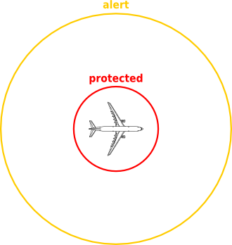
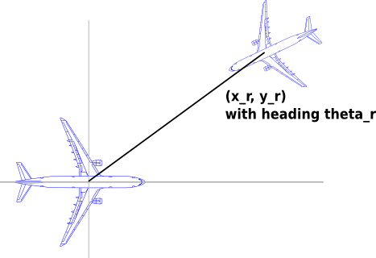

## Airtraffic Control ##

!REQUIRES: Lablgtk2

This example is taken from the paper: [_Conflict Resolution for Air Traffic
Management: A Case Study in Multiagent Hybrid
Systems_](http://dx.doi.org/10.1109/9.664154), Tomlin, Pappas, Sastry, 1998.

It models a _conflict resolution manouever_ for two planes: Aircraft1 and
Aircraft2. Both aircraft are flying at a similar altitude and with constant
velocity and heading. Two zones are defined around each aircraft:

A conflict resolution manouever is considered when two planes have entered
into each other's alert zones. The system aims to ensure that neither plane
ever enters the other's protected zone.

In the model, the position and heading of Aircraft1 define, respectively, the
origin and direction of the positive x-axis of a relative coordinate system,
in which the position of Aircraft2 is specified. The heading of Aircraft2 is
specified relative to the positive x-axis.

The initial condition in the model is that the aircraft are cruising outside
each other's protected zones, but inside each other's alert zones.

The manouever modelled in this case is (taken directly from the paper):

 1. _Cruise_

    Cruise until aircraft are `alpha1` miles apart.
 
 2. _Left_

    Make a heading change of `delta_phi` and fly until a lateral displacement
    of at least `d` miles is acheived for both aircraft.
 
 3. _Straight_

    Make a heading change to the original heading and fly until the aircraft
    are `alpha2` miles apart.
 
 4. _Right_

    Make a heading change of `-delta_phi` and fly until a lateral
    displacement of d miles is acheived for both aircraft.

 5. _Cruise_

    Make a heading change to original heading and cruise.

Note that, in the model at least, the heading changes occur simultaneously
and instantaneously.

!SOURCEFILE: airtraffic.zls

