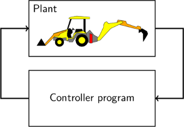
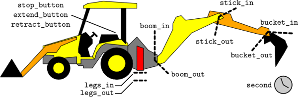
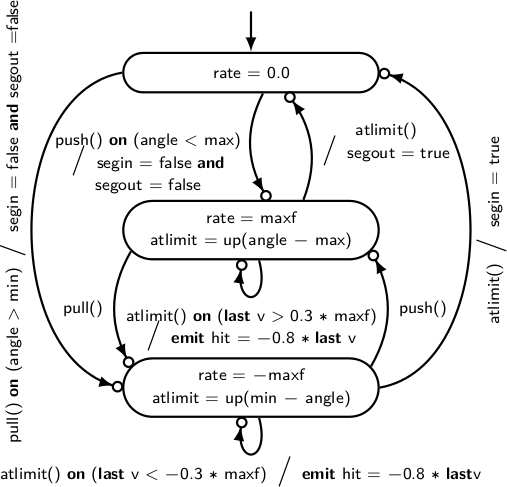

## Backhoe ##

!REQUIRES: Lablgtk2

The Backhoe loader is an [original
example](http://www.tbrk.org/esterel/backhoe.html) that we developed to
teach reactive programming.

The model comprises two interconnected elements:

 * a continuous model of the plant (parts of the backhoe)
 * a discrete controller

The original programming challenge focused on the discrete controller, but
expressing the continuous dynamics is also an interesting programming
problem, as is interfacing the two models.

The discrete controller receives input from sensors which are defined inside
the continuous model. There are sensors for each of three buttons
(`stop_button`, `extend_button`, and `retract_button`), for indicating
whether the legs are fully retracted (`legs_in`) or fully extended
(`legs_out`), and for indicating whether each of the rear segments is fully
retracted (`*_in`) or fully extended (`*_out`).

There are control signals for three lamps (`alarm_lamp`, `done_lamp`, and
`cancel_lamp`) and for triggering leg extension (`legs_extend`), leg
retraction (`legs_retract`), and stopping leg motion (`legs_step`). There
are three control signals pel segment: setting an internal valve for pushing
(`*_push`), or for pulling (`*_pull`), and for driving hydraulic fluid
through the valve (`*_drive`). It is assumed that a lower-level controller
maintains a segments position when it is not being driven.

Each segment is modelled using set of equations that include a hybrid
automaton. Two types of dynamics are modelled: moving and stopping with
momentum (modelled as a Proportional-Integral controller) and bouncing at
the limits of movement (modelled as instantaneous reset).

!SOURCEFILE: backhoecontrol.zls

!SOURCEFILE: backhoedyn.zls

Further details can be found in the paper [Zélus: A Synchronous Language
with ODEs](papers.html#HSCC2013).

