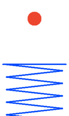

## Ball and Spring ##

Author: Cyprien Lecourt

A ball bouncing on a spring with damping. This example is programmed as a
two-state automaton. In the first state the ball and spring move separately:
the ball decelerating and eventually falling back to the spring, and the
spring oscillating with less and less energy. The second state is entered
when the ball lands on the platform, in it the ball and platform move
together until the ball becomes unstuck.

The calls to OCaml graphics for animating the system are written directly in
a discrete node. Additional calls are added to log the system state to a
file for [graphing](img/ball_spring.pdf) with
[gnuplot](http://gnuplot.sourceforge.net/).

!SOURCEFILE: ball_spring.zls

