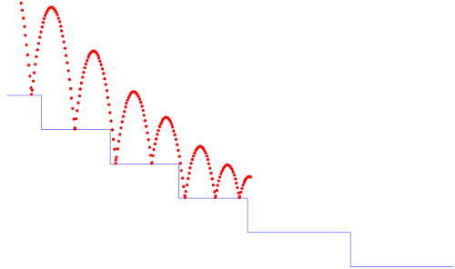

## Bouncing ball ##

A slight variation of the classic bouncing ball model: a ball bouncing down
a set of steps. The instants of impact are detected using zero crossings,
`up(ground(x) -. y)`, which trigger a reset of the balls vertical velocity
to -0.8 its previous value.

In the basic version of the program, the ball ‘falls through the floor’
due to limited floating-point precision.

!SOURCEFILE: ball.zls

With hybrid automata, it is instead possible to switch to a sliding dynamic
when the balls vertical velocity becomes very small.

!SOURCEFILE: autoball.zls

There is also a simpler model where the ball bounces up and down on the
spot.

!SOURCEFILE: flatball.zls

