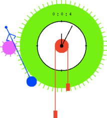

## Pendulum Clock ##

Author: [Guillaume Baudart](http://www.di.ens.fr/~baudart/)

This model was made to celebrate 
[Albert Benveniste's](http://people.rennes.inria.fr/Albert.Benveniste/)
[65th birthday](https://project.inria.fr/alberts65th/) in honour of
[“The old fashioned Signal watch”](http://people.rennes.inria.fr/Albert.Benveniste/pub/Polychrony.pdf).

The clock features an escapement that regulates the movement of two cogs
according to the oscillations of a pendulum. The `escapement` node generates
four events as the pendlum moves: `tic` and `toc` as the smaller, pink cog
is caught by the escapement and stopped from moving, and `rtic` and `rtoc`
as it is released and allowed to turn. When the ping cog is free, then
bigger, green cog can turn pulled by the falling `atwood` masses.
This in turn moves the clock hands.
The `clockwatch` node is an automaton with four modes:

* `Move`: the cogs are free to turn.
* `Stop`: the cogs are trapped by the escapement.
* `Exhausted`: there is no energy left in the masses.
* `Setting`: energy is added to the mass system.

A sound is emitted whenever the escapement catches (on `tic` and `toc`). The
spacebar is used to reset the position of the masses. The system state is
drawn by an external (OCaml) function called `draw_system`.

!SOURCEFILE: horloge.zls

