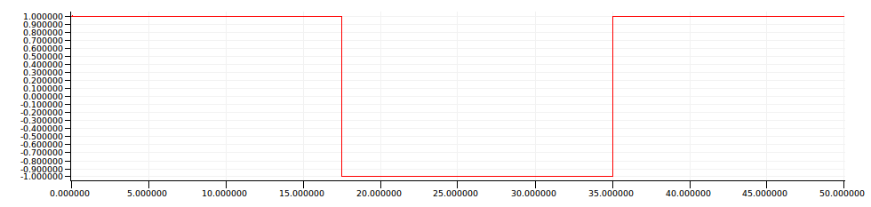
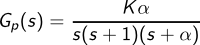
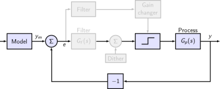
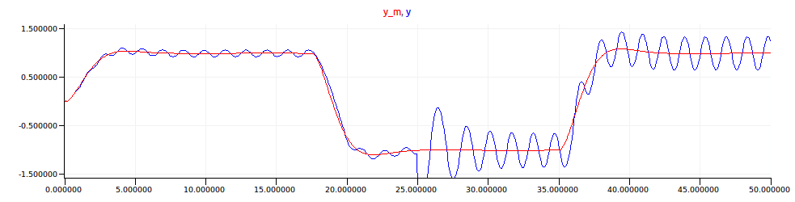
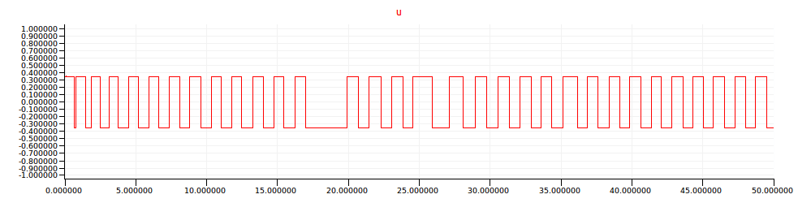
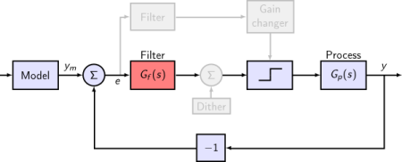
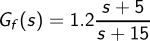
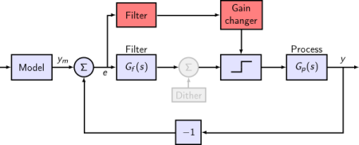
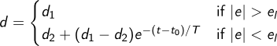
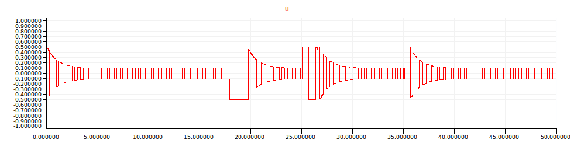

## Self-Oscillating Adaptive System ##

!REQUIRES: Lablgtk2

This example comes from Chapter 10 of Åström and Wittenmark's
[_Adaptive Control_](http://store.doverpublications.com/0486462781.html)
(2nd edition).

It involves the control of a simple process using adaptive relay feedback.
Together, the process and relay incite [limit cycle
oscillations](http://ocw.mit.edu/courses/mathematics/18-03-differential-equations-spring-2010/video-lectures/lecture-32-limit-cycles/),
giving systems with high feedback loop gain.

Three variations of the system are developed.
The shared elements are incorporated into a single file:

!SOURCEFILE: soas.zls

The models are tested over a period of 50s in response to a **command
signal** which starts at `1` initially, drops to `0` at `17.5` seconds, and
then rises to `1` again at `35` seconds.
The command signal is defined using a hybrid automaton in a node called
`command`.

The **process** to be controlled is described by the transfer function:

where, initially, K = 3 and α = 20, but where the _process gain is suddenly
increased by a factor of 5 at t = 25_.
The state-space realizations of these two systems are readily calculated in
either [Matlab](http://www.mathworks.com/products/matlab/):

<pre><code>sys1 = tf(60, [1 21 20 0])
[a, b, c, d] = ss()

sys2 = 5 * sys1
[a, b, c, d] = ss(sys2)
</code></pre>

or [Scilab](https://www.scilab.org/):

<pre><code>s=%s
sys1 = 60 / (s * (s + 1) * (s + 20))
[a, b, c, d] = abcd(sys1)

sys2 = 5 * sys1
[a, b, c, d] = abcd(sys2)
</code></pre>

We implement them in a node called `process` using a hybrid automaton and a
generic `siso_3o` node that takes the state-space matrices as tupled
arguments.

### Basic SOAS ###

The first model comprises a simple feedback loop—relay, process, and
inverter—that tries to follow the reponse of a reference model to the
command signal.
Other elements will be added successively.

!SOURCEFILE: soas1_basic.zls

The **reference model** is described as a second order system with damping
coefficient ζ = 0.7 and natural frequency ω_n = 1 rad/sec.
Its state-space realization is readily calculated in either
[Matlab](http://www.mathworks.com/products/matlab/):

<pre><code>[A, B, C, D] = ord2(1.0, 0.7)</code></pre>

or [Scilab](https://www.scilab.org/):

<pre><code>s = %s; wn = 1.0; zeta = 0.7;
tf2ss(syslin('c', wn^2, s^2 + 2*zeta*wn*s + wn^2))</code></pre>

We express it in a node called `reference` using a generic `siso_2o` node.

The response of the reference model to the command input is shown in red
below.
The actual output of the feedback loop is shown in blue.

The **relay** is modelled in a node called `relay` using a hybrid
automaton that alternates between `High` (output = `d`) and `Low` (output =
`-d`) states in response to zero-crossings on its input signal.
The relay's value is shown below.

### SOAS with lead network ###

The next model augments the basic model with a compensation network that
adds a phase lead of -π.

!SOURCEFILE: soas2_leadnet.zls

The compensation filter is defined as a transfer function:

which is implemented in the node `g_f` using the generic node `siso_1o`
after having calculated its state-space realization in either
[Matlab](http://www.mathworks.com/products/matlab/):

<pre><code>[a, b, c, d] = ss(1.2 * tf([1 5], [1 15]))</code></pre>

or [Scilab](https://www.scilab.org/):

<pre><code>s = poly(0, 's')
[a, b, c, d] = abcd(tf2ss(1.2 * (s + 5) / (s + 15)))</code></pre>

The compensation filter decreases the amplitude of oscillation while
maintaining the reponse speed, as can be seen in the simulation results
below.

### SOAS with lead network and gain changer ###

A gain changer is added in the final model.
It uses so called _up logic_ to speed up the controller's reponse.

!SOURCEFILE: soas3_gainchanger.zls

A gain changer increases the relay's amplitude (`d`) when a specified
tolerance (e_l) is exceeded.

This logic is readily implemented in the `gain_changer` node using a hybrid
automaton.

The simulation results show that the new controller responds with smaller
amplitude oscillations to the system with higher gain, without losing
performance for the system with smaller gain.

The effect of the gain changing logic on the relay output is evident in the
exponential envelopes on the signal shown below.

