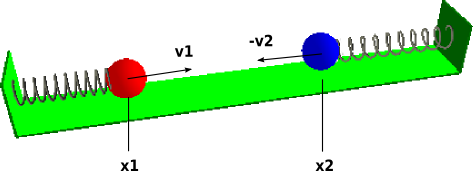

## Sticky Masses ##

!REQUIRES: Lablgtk2 (glMLite)

This example is based on example 6.8 in Edward A. Lee and Pravin Varaiya,
[_Structure and Interpretation of Signals and
Systems_](http://leevaraiya.org/), Second Edition,
and the Ptolemy II model by Jie Liu, Haiyang Zheng,
and Edward A. Lee.

The model comprises two sticky round masses, each on the end of a spring.
The other ends of the springs are tied to opposing walls. After the springs
are compressed (or extended) and released the masses oscillate back and
forth, and may collide. After a collision, the masses remain stuck together
until the pulling forces from the springs are greater than a _stickiness_
value (which decreases exponentially after a collision).

!SOURCEFILE: stickysprings.zls

