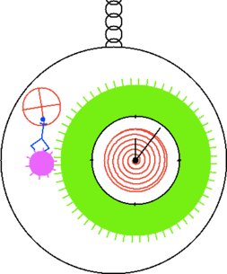

## Spring-driven Watch ##

Author: [Guillaume Baudart](http://www.di.ens.fr/~baudart/)

This model was made to celebrate 
[Albert Benveniste's](http://people.rennes.inria.fr/Albert.Benveniste/)
[65th birthday](https://project.inria.fr/alberts65th/) in honour of
[“The old fashioned Signal watch”](http://people.rennes.inria.fr/Albert.Benveniste/pub/Polychrony.pdf).

The watch features an escapement that regulates the movement of two cogs
according to the back and forth rocking of a regulator wheel. The
`escapement` node generates four events as the regulator moves: `tic` and
`toc` as the smaller, pink cog is caught by the escapement and stopped from
moving, and `rtic` and `rtoc` as it is released and allowed to turn. When
the ping cog is free, then bigger, green cog is pushed by the balance
spring. This in turn moves the clock hands. The `clockwatch` node is an
automaton with four modes:

* `Move`: the cogs are free to turn.
* `Stop`: the cogs are trapped by the escapement.
* `Exhausted`: there is no energy left in the masses.
* `Setting`: energy is added to the mass system.

A sound is emitted whenever the escapement catches (on `tic` and
`toc`). As an added bonus, the entire system can be made to swing back
and forth. The watch then behaves as a pendulum controlled by an
automaton with two modes.

* `Stop`: The pendulum does not move.
* `Move`: The pendulum starts moving with a fixed initial angular speed.

The user can switch between the two behaviors by pressing the `m` key.
The system state is drawn by an external (OCaml) function called
`draw_system`.

!SOURCEFILE: watch.zls

